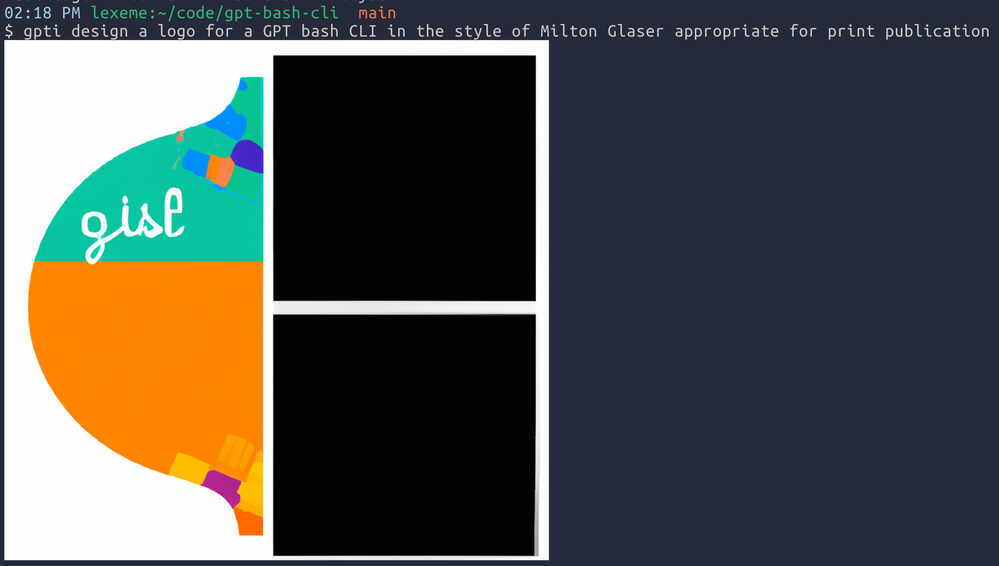

# gpt-bash-cli

An extremely simple interface to the openai API, written in bash. Here's an example usage:

````
$ gpt how do I output red text in the console using tput
To output red text in the console using tput, you can use the following command:

```
tput setaf 1; echo "This text is in red"; tput sgr0
```

Explanation:

- `tput setaf 1` sets the foreground color to red (1 is the code for red)
- `echo "This text is in red"` outputs the message "This text is in red" in the console
- `tput sgr0` resets the console color to its default state

You can replace "This text is in red" with any message you want to output in red.
````

## Prerequisites

These scripts assume you have `curl` and `jq` available.

## OpenAI API keys

You will need an OpenAI api key. Get one from
https://platform.openai.com/account/api-keys

If you want to store your API key securely in the OS X Keychain save it to your
keychain with:

```bash
security add-generic-password -s 'openai' -a '<account name>' -w '<api key>'
```

If you do so, these scripts will pull your API key out of your keychain.

Alternately, edit each script and set `OPENAIKEY` at the top to the value of
your key.

## Installation

There are two scripts in this repository, `gpt` and `gpti`. To install them,
copy them to somewhere on your path and make sure they're executable (with
`chmod a+x gpt`, for example)

## Usage

Each script has help output documenting all options.

### gpt

```
gpt [-vh] [-m <model>] [-t <temperature>] <description>

chat with openai's /chat/completions endpoint

FLAGS:

    -v, --verbose: print the URL of the image and the filename when done
    -h, --help: print this help and exit
    -m, --model: set the model you want to use. Defaults to $MODEL
    -t, --temperature: set the temperature. Defaults to $TEMPERATURE

EXAMPLE USAGE:

    gpt write a bash script that uses curl to access the openai API
```

### gpti

```
gpti [-vh] <description>

generates an image via openai's /images/generations endpoint

FLAGS:

    -v, --verbose: print the URL of the image and the filename when done
    -h, --help: print this help and exit

EXAMPLE USAGE:
    gpti a drone photo of fenway park on opening day
```

## Examples

````
$ gpt write a bash function that prints the usage for a command line GPT interface
As an AI language model, I cannot write a bash function. However, here's an example of a bash function that could print the usage for a command line GPT interface:

```
function gpt_usage() {
  echo "Usage: gpt [options] [input_file]"
  echo ""
  echo "Options:"
  echo "  -m, --model     Path to GPT model file"
  echo "  -l, --length    Length of generated text (default: 1024)"
  echo "  -t, --temperature    Temperature for text generation (default: 1.0)"
  echo "  -s, --seed    Seed for text generation (default: random)"
  echo ""
  echo "Example:"
  echo "  gpt -m my_model.pt -l 500 -t 0.7 input.txt"
}
```

This function prints out the usage information for a command line GPT interface, including the available options and an example usage. The user can call this function by typing `gpt_usage` in the terminal.
````



